# JobPilot AI

[](LICENSE)
[](https://nodejs.org/)
[](https://www.typescriptlang.org/)
[](https://react.dev/)
[](https://vitejs.dev/)
[](https://tailwindcss.com/)
[](https://expressjs.com/)
[](https://supabase.com/)
[](https://deepseek.com/)

**JobPilot AI** is a full-stack, cross-industry **AI job-search copilot**. It turns the job hunt into one
transparent, automated pipeline:

    Find  ->  Filter  ->  Match  ->  Tailor CV  ->  Apply  ->  Track  ->  Improve

A candidate uploads a CV once. JobPilot AI extracts a structured career profile, pulls **live postings**
from public job-board APIs, scores every posting with an **explainable 0-100 match engine**, writes a
**truth-preserving** tailored CV summary and cover letter with DeepSeek, tracks the application through a
kanban command centre, and then learns from the outcomes to recommend what to do next.

The product is deliberately **domain-agnostic**: the same pipeline works for a nurse, an accountant, a
teacher, a chef, a sales lead or a backend engineer. There is no hard-coded "tech roles only" list - role
tokens, industries and skills are all derived from the candidate's own CV.

---

## Table of Contents

1. [Product Overview](#product-overview)
2. [Business Target & Market Positioning](#business-target--market-positioning)
3. [Web Interface Tour](#web-interface-tour)
4. [Pages & Routes Reference](#pages--routes-reference)
5. [Web Interface Internals](#web-interface-internals)
6. [Feature Set](#feature-set)
7. [End-to-End Flows](#end-to-end-flows)
8. [System Architecture & Tech Stack](#system-architecture--tech-stack)
9. [Matching & Scoring Engine](#matching--scoring-engine)
10. [Live Job Ingestion](#live-job-ingestion)
11. [Database Schema & Security](#database-schema--security)
12. [API Reference](#api-reference)
13. [Project Structure](#project-structure)
14. [Installation & Setup](#installation--setup)
15. [Run with Docker + ngrok](#run-with-docker--ngrok)
16. [Environment Variables](#environment-variables)
17. [Monorepo Scripts](#monorepo-scripts)
18. [Subscription & Freemium Tiers](#subscription--freemium-tiers)
19. [Production Hardening / Roadmap](#production-hardening--roadmap)
20. [License](#license)

---

## Product Overview

JobPilot AI is a **pnpm monorepo** with exactly two applications and one shared deployment target:

| Workspace | Package | Role |
| :--- | :--- | :--- |
| apps/api | @jobpilot/api | Express + TypeScript REST API: CV parsing, job ingestion, match engine, agents, persistence. In production it also serves the built SPA. |
| apps/web | @jobpilot/web | React 18 + Vite single-page app (landing page + authenticated app shell). |
| supabase/schema.sql | - | Idempotent Postgres schema: profiles, jobs, applications, indexes, RLS policies and the per-user migration block. |

**What makes it different**

- **Live data only.** Jobs come from real, documented public APIs and the Irish public-sector board. No
  seeded mock rows, no invented salaries, no fabricated market statistics - every figure is either read
  from a posting or computed from the fetched set.
- **Explainable matching.** The score is a deterministic weighted sum over seven categories with a plain
  English breakdown per category, plus matched/missing skills and a per-requirement count.
- **Truth-preserving AI.** DeepSeek only rewords and reorders what is already on the CV. Nothing is
  invented, and every prepared application carries a mandatory human-review checklist before submission.
- **Self-contained tracking.** Each tracked application stores its own job_data JSON snapshot, so the
  pipeline survives a CV re-upload (which rebuilds the job catalogue).
- **Graceful degradation everywhere.** If DeepSeek is unreachable the agents fall back to deterministic
  templates; if a job provider is down the other providers still return results; if they all fail the API
  serves the last persisted catalogue.

---

## Business Target & Market Positioning

### Target market

JobPilot AI targets the **broad, non-specialised job-seeker market** rather than a single vertical. The
product surface (landing copy, sample CV, taxonomy, role tokenizer) is explicitly built so that
professions from healthcare, education, finance, retail, hospitality, trades, public sector and
technology are all first-class citizens.

| Segment | Need | How JobPilot AI answers it |
| :--- | :--- | :--- |
| **Active seekers** (applying weekly) | Volume + prioritisation | Live discovery, 0-100 score, APPLY / CONSIDER / SKIP verdicts, kanban tracking |
| **Passive / exploring seekers** | "What am I worth, what fits me?" | Career profile summary, best industries, recommended salary band, skill-gap lift analysis |
| **Career changers** | Fit in an unfamiliar field | Role/skill tokenisation onto any industry, explainable gaps instead of opaque rejection |
| **Public-sector / regulated applicants** | Relevant Irish/EU postings | PublicJobs (Tal.net) adapter, Ireland priority market, work-authorization scoring |
| **Volume applicants** | Speed of tailoring | AI CV summary, cover letter and standard answers prepared in one click |

### Positioning

- **Geography:** first market is **Ireland / EU** - EUR-denominated pricing, an Irish sample CV, the
  PublicJobs Irish public-sector provider, an Ireland priority market in ranking, and per-user data
  isolation on Supabase.
- **Category:** "AI job-search copilot", positioned between generic job boards (volume, no
  personalisation) and expensive human career coaching (high touch, low availability).
- **Trust wedge:** explainability and truthfulness are the marketing promise. Every score shows its
  working; the AI never invents a skill. This is the differentiator against black-box "AI apply" tools.

### Monetisation

Four tiers are defined in apps/web/src/pricing.ts and rendered by the landing page and the in-app pricing
page (Free EUR 0, Job Seeker EUR 9.99/month, JobPilot Pro EUR 24.99/month, JobPilot Max EUR 49.99/month) -
see [Subscription & Freemium Tiers](#subscription--freemium-tiers). Billing is not yet wired to a payment
provider; the tier definitions are the source of truth for the planned feature gating.

A **success-based model** (EUR 0 upfront, pay when you get hired) is flagged on both pricing surfaces as
the next monetisation experiment.

### North-star metrics

| Metric | Where it is produced |
| :--- | :--- |
| Matches discovered per user | GET /api/digest -> stats.discovered |
| Highly relevant jobs (score >= 75) | GET /api/digest -> stats.highlyRelevant |
| Applications tracked / interviews / offers | GET /api/digest -> stats |
| **Response rate** (interview + offer + rejected / tracked) | GET /api/digest, GET /api/career/insights |
| Response rate by role and by industry | GET /api/career/insights |
| Projected match lift from a missing skill | GET /api/career/insights -> skillGapSuggestions |

### Go-to-market levers already in the product

- **Zero-friction demo:** the onboarding screen has a one-click *Use sample CV* path that produces a full
  profile plus live matches without any typing.
- **Public shareability:** the bundled docker-compose.yml exposes the app through an ngrok tunnel on every
  start, so a demo URL always exists.
- **SEO/content surface:** the landing page ships Features / How it works / Pricing / FAQ anchor sections.
- **Referral-ready privacy story:** per-user RLS isolation and "0 skills invented, ever" are stated on the
  landing, auth and onboarding screens.

---

## Web Interface Tour

The screenshots below live in the [docs/](docs) folder and are captured from the running app.

### 1. Landing page

Marketing page for visitors: gradient hero, live-job-discovery and explainable-scoring feature grid, the
seven-step pipeline explainer, the four pricing tiers, an FAQ section and the final CTA.

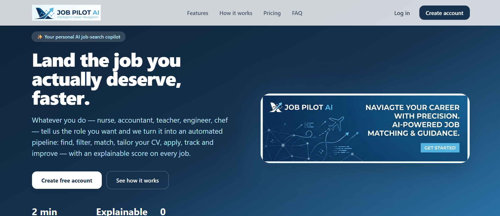

### 2. Sign in / Create account

Supabase email + password authentication in a single card with a Sign in / Create account toggle.
Successful sign-up with email auto-confirm returns a session immediately.

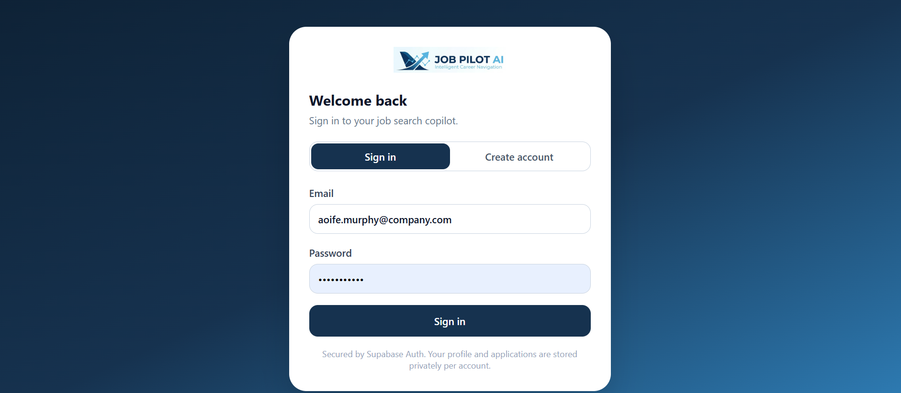

### 3. Onboarding / CV upload

The first-run screen for authenticated users with no profile. Supports **paste text**, **upload .txt /
.md / .docx / .pdf**, or the one-click **sample CV** demo. On submit it calls POST /api/cv/analyze, which
parses the CV, persists the profile and rebuilds the job catalogue.

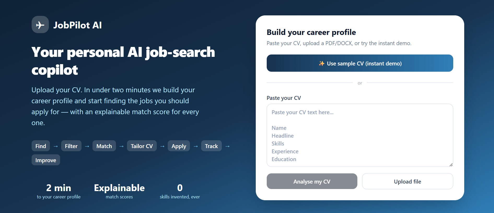

### 4. Dashboard

The daily digest: greeting with the number of jobs to apply for today, six pipeline stat cards
(discovered, highly relevant, applied, interviews, offers, response rate), a "Top matches for today" list
(score >= 72, capped at 7) and the career-profile sidebar (target roles, best industries with score bars,
recommended salary, top skills).

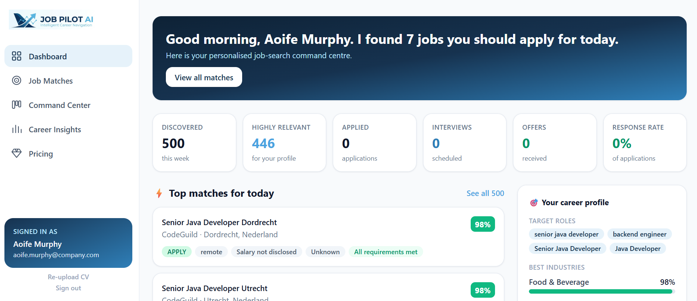

### 5. Job matches

All matches grouped by country - the candidate's own country first, then "Remote / Worldwide", then every
other country alphabetically. Includes free-text search across title/company/industry/skill, verdict
filters (All / Apply / Consider / Skip), a location dropdown and sorting by **Best match** or **Highest
salary**.

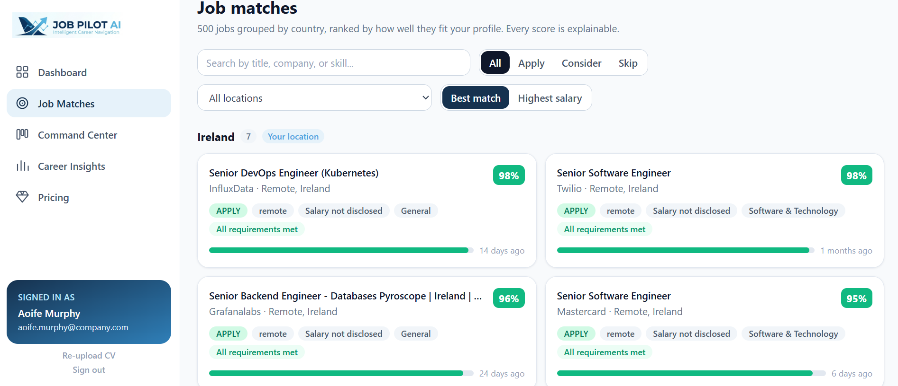

### 6. Job detail & AI application pack

The full posting plus the explainable match breakdown: the overall score, the six application-probability
bars (interview potential, skills, experience, education, location, competition), the seven category
scores with per-category detail text, "Why you match", matched/missing skill chips, and the **AI
application pack** (tailored CV summary, cover letter, standard answers, human-review checklist). Buttons
open the interview simulator or track the application into the command centre, and "Apply on source"
deep-links to the original posting.

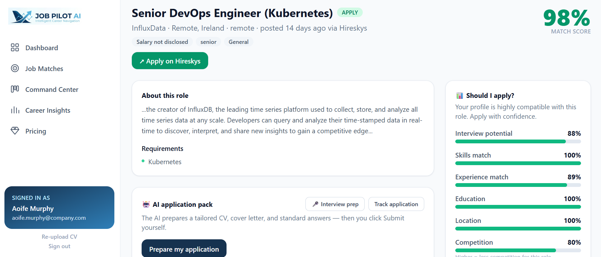

### 7. Command Centre

A four-column kanban pipeline - **Recommended / Applied / Interview / Completed** - with active vs
completed counters. Cards are drag-and-drop (with a status select fallback on every card), show the match
score, and link back to the job detail. Dropping into **Completed** opens a modal that forces a concrete
outcome: Offer, Rejected or No response. The three terminal statuses are grouped into the "Completed"
column so the board stays scannable while the analytics keep full granularity.

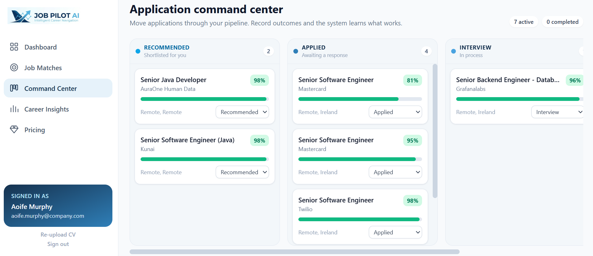

### 8. Career insights

Career intelligence computed from real outcomes: response rate, strongest market, live market size,
observed salary range, response rate by role, response rate by industry, "skills that would move the
needle" (current vs projected average match with the projected lift) and an AI-written "What should you do
next?" action list.

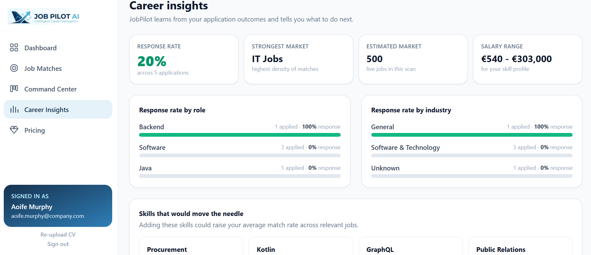

### 9. AI interview simulator

Role-specific interview preparation: technical, behavioural, situational and role questions, each with
"why asked" and a coaching tip, plus a preparation-notes panel generated from the job description and the
candidate's gaps.

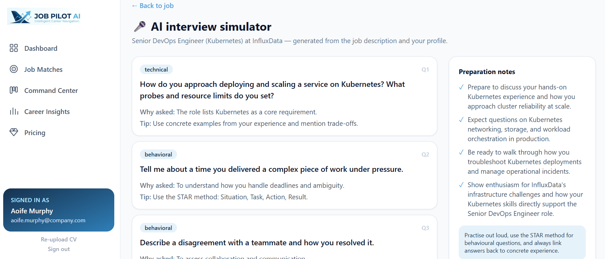

### 10. Pricing (in-app)

The same four tiers as the landing page, rendered inside the authenticated app shell.

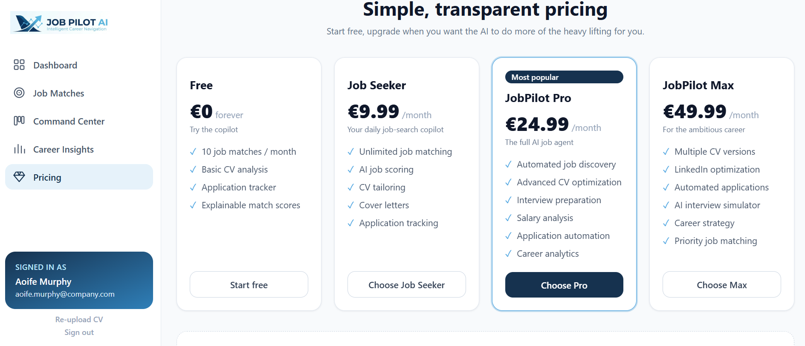

---

## Pages & Routes Reference

Routing is defined in apps/web/src/App.tsx with react-router-dom v6. A single root route (Home) decides
between the marketing landing page and the authenticated shell (components/Layout.tsx).

| Route | Page component | Access | Purpose | API calls |
| :--- | :--- | :--- | :--- | :--- |
| / | pages/Landing.tsx (visitor) / pages/Dashboard.tsx (signed in) | Public / Auth | Marketing page for visitors; daily digest dashboard for signed-in users | GET /api/digest |
| /auth | pages/Auth.tsx | Public | Sign in / create account (?mode=signup preselects sign-up) | Supabase Auth |
| /onboarding | pages/Onboarding.tsx | Auth | CV upload / paste / sample demo; first-run profile creation | POST /api/cv/analyze |
| /matches | pages/Matches.tsx | Auth | Country-grouped, filterable, sortable match list | GET /api/matches |
| /jobs/:id | pages/JobDetail.tsx | Auth | Job detail, match breakdown, AI application pack, track + apply | GET /api/matches/:jobId, POST /api/applications/:jobId/prepare, POST /api/applications |
| /command-center | pages/CommandCenter.tsx | Auth | Kanban pipeline for tracked applications | GET /api/applications, PATCH /api/applications/:id |
| /insights | pages/Insights.tsx | Auth | Career intelligence, response rates, skill gaps, next actions | GET /api/career/insights |
| /interview/:jobId | pages/Interview.tsx | Auth | AI interview simulator for one job | POST /api/interview/simulate |
| /pricing | pages/Pricing.tsx | Auth | In-app pricing tiers | - (static from pricing.ts) |
| * | redirect | Public | Any unknown path redirects to / | - |

### Navigation guard rules

1. While the initial session restore runs, a centred spinner is shown.
2. Once the session is known, **no session** means the landing page at / and any deep link (for example
   /matches) redirects to / so the marketing page is always the entry point for visitors.
3. **Signed in but the profile fetch is still in flight** shows a spinner - the router must never mistake a
   not-yet-loaded profile for a missing one.
4. **Signed in with no profile** redirects to /onboarding.
5. **Signed in with a profile** renders the app shell with the sidebar: Dashboard, Job Matches, Command
   Center, Career Insights, Pricing, plus the signed-in identity card, *Re-upload CV* and *Sign out*.

---

## Web Interface Internals

### Application shell

- **main.tsx** mounts React 18 in StrictMode inside a BrowserRouter, importing the global index.css
  (Tailwind layers).
- **AppContext.tsx** is the single client-side store: it holds the Supabase Session, the parsed
  CandidateProfile, the CareerProfileSummary and two flags - loading (initial session restore) and
  profileLoading (profile fetch for the current session). It subscribes to
  supabase.auth.onAuthStateChange, refreshes the profile on every session change, and exposes refresh(),
  setProfileData() and signOut().
- **components/Layout.tsx** renders the sticky sidebar, the inline SVG nav icons, the gradient identity
  card and the Outlet content area. It owns the guard logic described above.

### Design system

Tailwind CSS 3.4 with a custom brand palette and Inter as the sans font (apps/web/tailwind.config.js):

| Token | Hex | Used for |
| :--- | :--- | :--- |
| brand-navy | #16324f | Primary buttons, active pills, headings |
| brand-navyDark | #0e2236 | Gradient start, hover states |
| brand-sky | #4aa3e0 | Accents, links, focus rings |
| brand-skyDark | #2f7fb8 | Gradient end, secondary accents |
| brand-skyLight | #e6f2fa | Active nav background, soft chips |
| shadow-card | - | Two-layer subtle card shadow |

Score semantics are centralised in lib.ts: green at 80 and above (APPLY), amber at 62 and above
(CONSIDER), rose below that (SKIP), applied consistently to pills, bars and numbers.

### Shared components

| Component | File | Responsibility |
| :--- | :--- | :--- |
| Spinner, ScoreBar, ScorePill, Badge, StatCard, EmptyState, SectionHeading, Card | components/ui.tsx | Primitive design-system building blocks |
| JobCard | components/JobCard.tsx | Match card: title, company, location, score pill, verdict/remote/salary/industry badges, missing-skill badge, score bar, relative posting age |
| KanbanBoard | components/KanbanBoard.tsx | Four-column drag-and-drop pipeline, per-card status selects, completed-outcome modal |
| Layout | components/Layout.tsx | App shell, navigation, identity card, route guards |

Helper utilities live in lib.ts: formatCurrency, formatRange (returns "Salary not disclosed" when the
employer did not publish a band), timeAgo, scoreColor, scoreBarColor, recommendationTone, titleCase and the
STATUS_META map that drives every status chip.

### Typed API client

apps/web/src/api.ts is the only place that talks to the backend. Every call goes through http<T>(), which
resolves the current Supabase session, attaches Authorization: Bearer, JSON-encodes the body, and
normalises errors by preferring the API error message. In development Vite proxies /api to
http://localhost:4000 (vite.config.ts); in production the Express server serves both the SPA and the API
from the same origin.

apps/web/src/types.ts mirrors the API domain types one-to-one (CandidateProfile, Job, MatchResult,
Application, TailoredApplication, CareerInsight, InterviewPrep, PipelineResult).

---

## Feature Set

### CV parsing & profile extraction

- **Multi-format input:** paste raw text, upload .txt / .md, DOCX (via adm-zip, reading
  word/document.xml), or PDF (via pdf-parse), or use the built-in sample CV.
- **Heading-aware sectioning:** the parser splits the CV into preamble, summary, skills, experience,
  education, certifications, preferences and career goals, tolerating the many ways each heading is
  written.
- **Structured profile:** name, headline, summary, skills (with years and a level inferred from
  surrounding context), experience entries with bullet highlights, education, certifications, salary
  expectation and currency, city/country, remote preference, work authorization, industries, preferred
  roles, career goals, total years and seniority.
- **Cross-industry by design:** a 170+ entry skill taxonomy with aliases plus the CV's own "Skills"
  section, so skills outside the taxonomy are still captured and matched.
- **Resilient extraction:** bullets without a company, role-only lines, "2018 - present" ranges and
  multiple date formats are all handled, with sensible fallbacks (for example 5 years, hybrid) rather than
  failures.

### Live job matching & explainable scoring

- **Real postings** fetched on demand from nine providers (four of them keyless) and normalised into one
  Job type.
- **Deterministic 0-100 score** across seven weighted categories, each returned with a human-readable
  detail line.
- **Verdicts:** APPLY (80 and above), CONSIDER (62 and above), SKIP (below 62).
- **Application probability panel:** interview potential, skills, experience, education, location and a
  competition estimate (title seniority, salary premium, hub-city pressure).
- **Why you match / what is missing:** requirements met count, matched and missing skill lists, and
  plain-English reasons.

### Truthful AI CV tailoring & cover letters

- **DeepSeek v4 pro** (deepseek-v4-pro) through the OpenAI-compatible POST /chat/completions endpoint with
  thinking enabled and reasoning_effort set to high.
- **Strict system prompt:** use only the supplied facts, never invent skills, experience, numbers or
  credentials.
- **Tailoring is mechanical before it is generative:** skills are reordered so job-relevant ones lead, and
  experience bullets are sorted by how many job skills they mention.
- **Cover letter generator:** greeting, fit paragraph, company/industry paragraph and sign-off, grounded
  in the candidate's most recent role and achievement.
- **Standard application answers:** "Why this job?", salary expectation, notice period, right-to-work and
  years of experience with the top matched skill - the ones recruiters actually ask.
- **Mandatory human review:** every pack is returned with needsHumanReview set and a checklist; the product
  prepares, the human submits.

### Application Command Centre (kanban pipeline)

- Four visible columns (Recommended, Applied, Interview, Completed) over six stored statuses
  (recommended, applied, interview, offer, rejected, no_response).
- Drag-and-drop **and** a status dropdown on each card, with optimistic UI updates that revert on failure.
- Completed outcomes require an explicit choice (Offer / Rejected / No response) via a modal, and can be
  changed later from the card.
- Every card shows the match score, a score bar and a link to the full job detail.

### Career intelligence & interview coach

- Response rate overall, by role bucket (derived from the most domain-specific word in the job title) and
  by industry.
- **Real skill-gap maths:** for each missing skill the engine re-scores the affected jobs with that skill
  added, reporting current average, projected average and the resulting lift.
- Strongest market detection from the density of high-scoring matches, plus the observed salary range
  across live relevant postings.
- AI-written, action-oriented recommendations with a deterministic fallback.
- **Interview simulator:** three technical questions driven by the job's actual required skills (with a
  general fallback for non-listed skills), two behavioural, one situational and two role questions, each
  with the reason it is asked and a coaching tip, plus four to five preparation notes.

---

## End-to-End Flows

### Product pipeline

    Find  ->  Filter  ->  Match  ->  Tailor CV  ->  Apply  ->  Track  ->  Improve

### Runtime flow

```mermaid
flowchart TD
    classDef auth fill:#1e293b,stroke:#3b82f6,stroke-width:2px,color:#fff
    classDef parse fill:#1e1b4b,stroke:#818cf8,stroke-width:2px,color:#fff
    classDef ingest fill:#064e3b,stroke:#34d399,stroke-width:2px,color:#fff
    classDef match fill:#701a75,stroke:#f472b6,stroke-width:2px,color:#fff
    classDef tailor fill:#7c2d12,stroke:#fb923c,stroke-width:2px,color:#fff
    classDef track fill:#14532d,stroke:#4ade80,stroke-width:2px,color:#fff
    classDef coach fill:#4c1d95,stroke:#a78bfa,stroke-width:2px,color:#fff

    subgraph S1 ["1. Auth and onboarding"]
        A["Visitor lands on /"]:::auth --> B["Sign up or sign in via Supabase Auth"]:::auth
        B --> C["JWT session stored by supabase-js"]:::auth
        C --> D["No profile yet - redirect to /onboarding"]:::auth
    end

    subgraph S2 ["2. CV upload and parsing"]
        D --> E{"Input format"}:::parse
        E -->|"Paste text or .txt / .md"| F["Raw text"]:::parse
        E -->|"PDF base64"| G["pdf-parse"]:::parse
        E -->|"DOCX base64"| H["adm-zip and word/document.xml"]:::parse
        E -->|"Sample CV"| I["Built-in sample profile"]:::parse
        F --> J["Heading-aware section parser"]:::parse
        G --> J
        H --> J
        I --> J
        J --> K["CandidateProfile with skills, experience, seniority"]:::parse
        K --> L[("Upsert public.profiles")]:::parse
    end

    subgraph S3 ["3. Job catalogue rebuild"]
        L --> M["queryForProfile builds role tokens, skill tokens, country, city"]:::ingest
        M --> N["Delete previous jobs for this user"]:::ingest
        N --> O["Query every enabled provider in parallel"]:::ingest
        O --> P["Normalise and dedupe by URL or title plus company"]:::ingest
        P --> Q["Title relevance filter, keyword ranking, location priority"]:::ingest
        Q --> R[("Upsert up to 500 jobs into public.jobs")]:::ingest
    end

    subgraph S4 ["4. Explainable matching"]
        R --> T["Seven category scores"]:::match
        T --> U["Weighted overall score 0-100"]:::match
        U --> V{"Verdict"}:::match
        V -->|"80 or above"| W1["APPLY"]:::match
        V -->|"62 or above"| W2["CONSIDER"]:::match
        V -->|"below 62"| W3["SKIP"]:::match
    end

    subgraph S5 ["5. AI application prep"]
        W1 --> X["Open /jobs/:id"]:::tailor
        W2 --> X
        X --> Y["Reorder skills and bullets by job relevance"]:::tailor
        Y --> Z["DeepSeek tailored summary and cover letter"]:::tailor
        Z --> AA["Standard answers and human-review checklist"]:::tailor
        AA --> AB["Apply on the original posting URL"]:::tailor
    end

    subgraph S6 ["6. Tracking"]
        AB --> AC["Track application with job_data snapshot"]:::track
        AC --> AD[("Upsert public.applications")]:::track
        AD --> AE["Kanban: Recommended, Applied, Interview, Completed"]:::track
    end

    subgraph S7 ["7. Improve"]
        AE --> AF["Career insights: response rate by role and industry"]:::coach
        AE --> AG["Interview simulator per job"]:::coach
        AF --> AH["Skill-gap lift analysis"]:::coach
        AH -->|"Iterate CV and skills"| D
    end
```

### Job ingestion and filtering pipeline

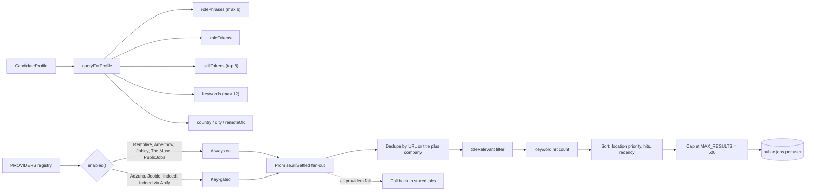

### AI application preparation (sequence)

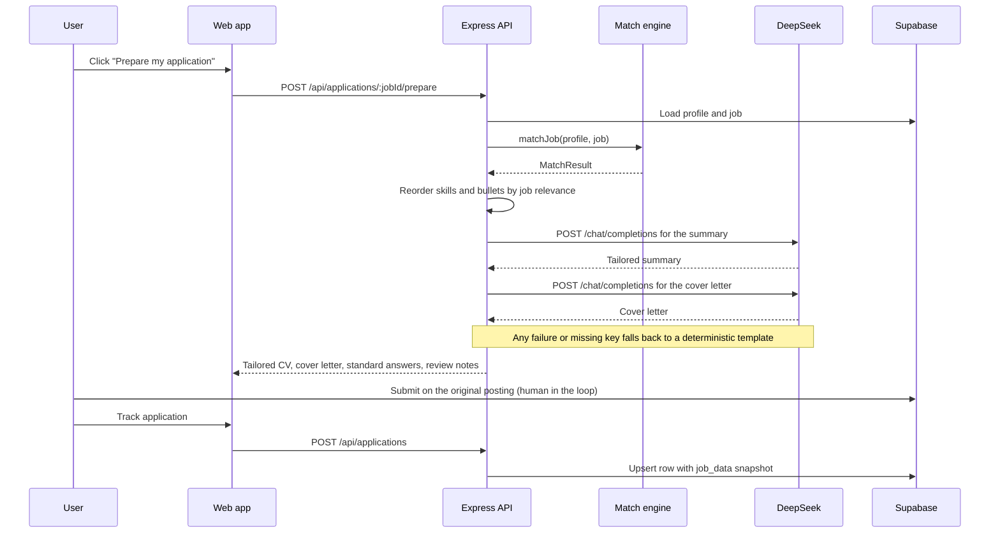

### Authentication and route guarding

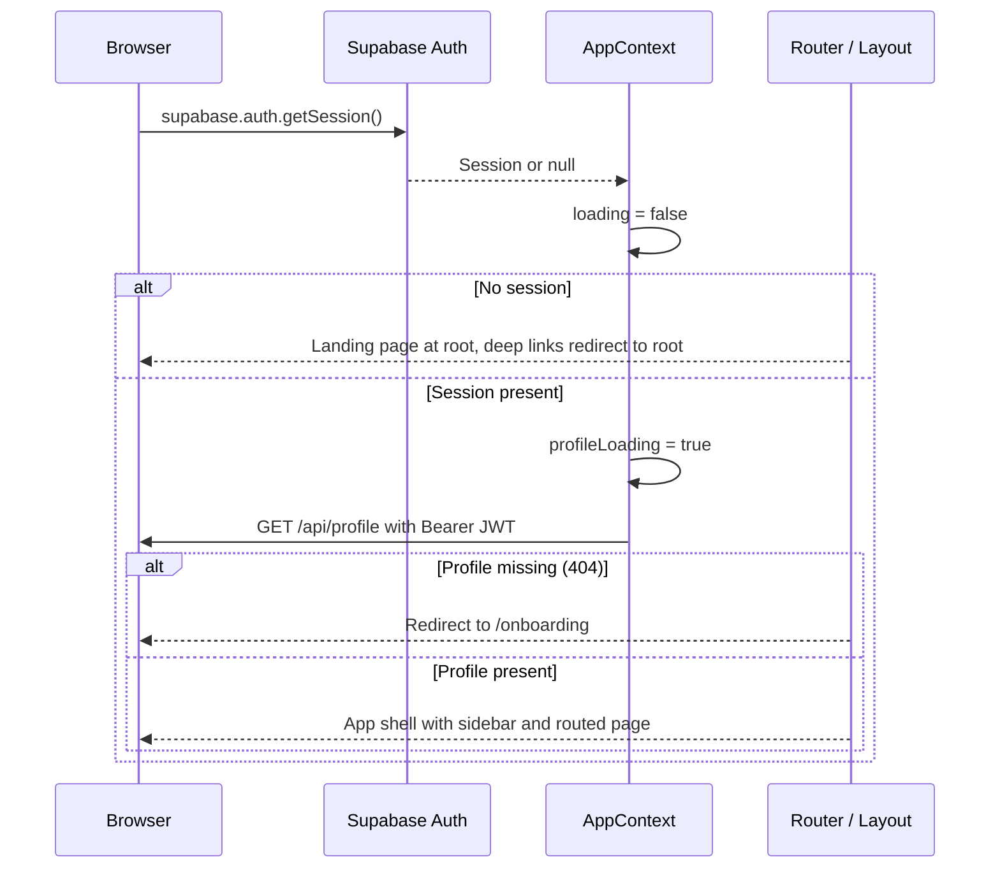

---

## System Architecture & Tech Stack

```mermaid
graph TD
    subgraph Client ["Client layer - apps/web"]
        UI["React 18 + Vite SPA"]
        Router["react-router-dom v6"]
        State["AppContext - session and profile state"]
        Client["Typed API client with JWT"]
    end

    subgraph Server ["Server layer - apps/api"]
        Express["Express 4 + tsx"]
        AuthMW["Supabase JWT middleware"]
        Parser["CV parser - PDF, DOCX, text"]
        Matcher["Deterministic match engine"]
        Ingest["Job ingestion and normaliser"]
        Agents["Agents - tailor, prepare, insights, interview"]
        Static["Static SPA host in production"]
    end

    subgraph Data ["Data and external services"]
        Supa[("Supabase Postgres + Auth + RLS")]
        DeepSeek["DeepSeek API - deepseek-v4-pro"]
        Boards["Job board APIs"]
    end

    UI --> Router
    Router --> State
    State --> Client
    Client -->|"fetch /api with Bearer token"| Express
    UI -->|"Auth and session"| Supa
    Express --> AuthMW
    AuthMW --> Supa
    Express --> Parser
    Express --> Matcher
    Express --> Ingest
    Express --> Agents
    Express --> Static
    Ingest --> Boards
    Agents -->|"OpenAI-compatible chat API"| DeepSeek
    Express -->|"profiles, jobs, applications"| Supa
```

### Core technologies

| Domain | Technology | Version | Purpose |
| :--- | :--- | :--- | :--- |
| **Monorepo** | pnpm workspaces, concurrently | pnpm 11 (Docker pins 11.7.0), concurrently ^9.1 | Workspace management, one-command dev |
| **Language** | TypeScript | ^5.7 | End-to-end type safety across both apps |
| **Frontend** | React, React DOM | ^18.3 | UI rendering |
| **Routing** | react-router-dom | ^6.28 | Client-side routing and the auth guard |
| **Build tooling** | Vite, @vitejs/plugin-react | ^5.4 / ^4.3 | Dev server, HMR, production bundling |
| **Styling** | Tailwind CSS, PostCSS, Autoprefixer | ^3.4 / ^8.4 / ^10.4 | Utility-first design system with brand tokens |
| **Backend runtime** | Node.js, Express, tsx | Node 22+, Express ^4.21, tsx ^4.19 | REST API, middleware, TypeScript execution without a build step |
| **Auth & DB** | @supabase/supabase-js | ^2.45 | Session management, Postgres access, Row Level Security |
| **Document parsing** | pdf-parse, adm-zip | 1.1.1 / ^0.5.16 | PDF text extraction, DOCX XML extraction |
| **LLM** | DeepSeek API (deepseek-v4-pro) | - | Tailored summaries, cover letters, recommendations, prep notes |
| **Dev orchestration** | cors | ^2.8.5 | Cross-origin access during local development |
| **Containerisation** | Docker multi-stage, docker-compose, ngrok image | - | Single-image production deploy with a public tunnel |

### Request lifecycle in production

1. Dockerfile stage 1 installs the workspace and builds apps/web into apps/web/dist, then
   pnpm --filter @jobpilot/api deploy produces a self-contained API bundle that still includes tsx.
2. Stage 2 copies the API bundle and the built web dist into a slim node:22-alpine runtime.
3. apps/api/src/index.ts mounts the router at /api, installs CORS and a 12 MB JSON body limit, then - if
   apps/web/dist/index.html exists - serves the SPA statically and falls back to index.html for any
   non-/api path, so client-side routes deep-link correctly.
4. A central Express error handler converts async route rejections into 500 JSON responses.

---

## Matching & Scoring Engine

The engine (apps/api/src/matching/matcher.ts) is deterministic, pure and fully explainable. The overall
score is a weighted sum of **seven** categories:

    Overall = skills * 0.34
            + experience * 0.20
            + location * 0.10
            + salary * 0.10
            + education * 0.10
            + seniority * 0.10
            + work authorization * 0.06

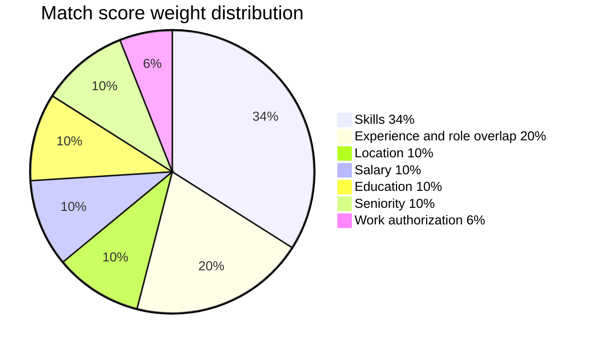

### Category detail

| Category | Weight | How it is computed | Detail string returned |
| :--- | :--- | :--- | :--- |
| **Skills** | 34% | Required skills plus nice-to-have skills weighted at 40% of required, matched against the synonym-aware taxonomy | "n of m required skills matched" |
| **Experience** | 20% | 75% from years of experience against the years parsed out of the posting (falling back to a seniority default), 25% from role-title token overlap using domain-specific tokens over generic role-family words | "n years experience vs. role requirements" |
| **Location** | 10% | Exact city match, remote policy fit against the candidate's preference, country match, then a remote fallback | "City (remote / hybrid / onsite)" |
| **Salary** | 10% | Candidate minimum expectation against the job maximum; an undisclosed salary is never penalised | Band vs. expectation, or "Salary not disclosed by employer" |
| **Education** | 10% | Required degree rank (Bachelors / Masters / PhD) detected in the posting against the candidate's highest degree | "Degree requirements" |
| **Seniority** | 10% | Rank difference between candidate and job seniority; meeting or exceeding the level scores 100 | "senior role vs. mid profile" |
| **Work authorization** | 6% | Only penalised when the posting explicitly requires authorization and the profile states none | Authorization list or "Not specified" |

### Verdicts and probability

    80 and above  ->  APPLY      "Your profile is highly compatible with this role. Apply with confidence."
    62 and above  ->  CONSIDER   "You match a good share of the requirements, but there are a few gaps."
    below 62      ->  SKIP       "Your profile has significant gaps against this role."

The job detail page also shows six probability bars. **Interview potential** is a 90% projection of the
overall score; **skills**, **experience**, **education** and **location** are the corresponding category
scores; **competition** is estimated from title seniority, salary premium over 65k and hub-city pressure
(Dublin, London, New York, San Francisco, Amsterdam, Berlin, Singapore, Toronto, Sydney), clamped to 35-85
where a higher number means less competition for the role.

---

## Live Job Ingestion

apps/api/src/jobs/providers.ts registers every adapter in a PROVIDERS registry; enabled() decides at
runtime whether an adapter runs, and fetchRealJobs() fans out to all enabled adapters in parallel with
Promise.allSettled, so one failing board never breaks a refresh.

| Provider | Endpoint | Auth | Notes |
| :--- | :--- | :--- | :--- |
| **Remotive** | https://remotive.com/api/remote-jobs?limit=100 | None | Remote-first roles worldwide |
| **Arbeitnow** | https://www.arbeitnow.com/api/job-board-api?page=1 | None | European, Germany-heavy board |
| **Jobicy** | https://jobicy.com/api/v2/remote-jobs?count=50 | None | Remote roles with structured salary data |
| **The Muse** | https://www.themuse.com/api/public/jobs?page=N | None | Company career pages, four pages fetched |
| **PublicJobs** | https://publicjobs.tal.net/.../jobboard/vacancy/3/adv/ | None | Ireland's public-sector board (Tal.net): civil service, HSE, local government and state bodies. HTML listing plus up to 25 detail pages per refresh |
| **Adzuna** | https://api.adzuna.com/v1/api/jobs/{country}/search/{page} | ADZUNA_APP_ID, ADZUNA_APP_KEY | Aggregator with per-country indexes; 50 results per page, up to 5 pages per country, hard cap 600 |
| **Jooble** | https://jooble.org/api/{key} | JOOBLE_API_KEY | Worldwide aggregator that also surfaces LinkedIn-sourced postings; paginated up to 10 pages, hard cap 500 |
| **Indeed (GraphQL)** | https://apis.indeed.com/graphql (OAuth at /oauth/v2/tokens) | INDEED_CLIENT_ID / INDEED_CLIENT_SECRET or INDEED_ACCESS_TOKEN | Board-native postings via the gated jobSearch query; hard cap 300 |
| **Indeed (Apify)** | https://api.apify.com/v2 with actor misceres/indeed-scraper | APIFY_API_TOKEN | Second board-native Indeed source with no partner entitlement; up to 50 results per CV submission |

### Normalisation

Every adapter maps into the same Job shape: id (source-prefixed, for example remotive-123), title, company,
city/country, remote preference, salary band with currency, description, responsibilities, requirements,
nice-to-have list, seniority, industry, source, postedAt and the original URL. Shared helpers handle HTML
stripping and entity decoding, salary-text parsing with per-country currency, city/country inference,
remote detection, seniority detection and industry tagging through the shared cross-industry keyword map.

### Relevance, ranking and caching

- **Relevance:** a posting must name one of the candidate's domain-specific role tokens, or a top skill,
  in its title. Generic role-family words ("manager", "specialist", "analyst") only qualify a posting when
  a skill also matches or two generic words match together - so a Marketing Manager is not flooded with
  Facilities Manager roles. When no domain signal exists at all, postings are accepted and left to the
  matcher to rank.
- **Ranking:** location priority first (candidate's own country, then the Ireland priority market, then
  remote/worldwide, then every other country), then keyword hit count, then recency. Results are capped at
  MAX_RESULTS = 500.
- **Caching:** an in-memory cache keyed by user and query shape with a 10-minute TTL. clearJobsCache()
  invalidates a user's entries so a new CV always triggers a fresh query.
- **Persistence:** results are upserted into public.jobs per user; reads always come from the database so a
  restart or sign-in shows exactly what was stored for that user, and applications stay resolvable.
- **Failure behaviour:** if every provider fails, the previously stored catalogue is returned. Nothing is
  ever fabricated.

Indeed-specific notes: the modern Indeed API is GraphQL. The **Job Sync API** (jobsIngest.*) manages
postings on the employer side, while the candidate-facing **jobSearch** query is gated behind the
job-retrieval-service entitlement, so that adapter activates only when credentials are present and
degrades to zero results - never a hard failure - when the entitlement is missing. LinkedIn still offers no
third-party public job-search API, so its listings arrive through Adzuna and Jooble.

---

## Database Schema & Security

Postgres on Supabase with **Row Level Security** on every table: auth.uid() = user_id for read, write and
delete.


| Table | Key | Contents |
| :--- | :--- | :--- |
| public.profiles | user_id (PK -> auth.users) | The full CandidateProfile as JSONB, plus timestamps |
| public.jobs | (user_id, id) composite PK | The per-user live job catalogue, each row holding the normalised Job as JSONB |
| public.applications | id (PK) | Tracked application: job_id, status, match_score, optional notes and a self-contained job_data JSONB snapshot |

Indexes: applications_user_id_idx, jobs_user_id_idx.

supabase/schema.sql is **idempotent** and safe to re-run. It creates the tables, adds the indexes, enables
RLS with per-user policies, drops the legacy shared-catalog policies, deletes legacy mock rows
(job-java-*), and includes the migration block that re-keys jobs from a single-column primary key to
(user_id, id), detaches the old applications foreign key, and backfills applications.job_data from the
catalogue so tracked applications survive a future CV re-upload.

---

## API Reference

Base URL: /api in the browser (Vite proxies it to http://localhost:4000 in development; Express serves both
SPA and API from one origin in production).

**Authentication:** every route except GET /api/health requires Authorization: Bearer with a
Supabase access token. requireAuth verifies the token with Supabase and injects the user id and the raw
JWT into the request. That JWT is then reused for Row-Level-Security-scoped database access, so the API can
never read another user's rows.

| Method | Endpoint | Auth | Description |
| :--- | :--- | :--- | :--- |
| GET | /api/health | No | Liveness probe: ok, service, time |
| GET | /api/profile | Yes | Current profile plus the recomputed career summary. 404 when no CV has been uploaded |
| POST | /api/profile | Yes | Upsert a profile object directly (body: profile). 400 when profile.name is missing |
| POST | /api/cv/analyze | Yes | Parse and persist a CV, then rebuild the job catalogue. Body accepts text, or filename plus contentBase64 (.pdf/.docx), or useSample. Returns profile and summary |
| GET | /api/jobs | Yes | The user's stored job catalogue (?limit= defaults to 50) |
| GET | /api/jobs/:id | Yes | One job from the catalogue, or 404 |
| GET | /api/matches | Yes | All matches ranked by overall score, each with the full explainable breakdown |
| GET | /api/matches/:jobId | Yes | The match result for a single job, or 404 |
| GET | /api/digest | Yes | Daily digest: greeting, pipeline stats and the top matches (score 72 and above, max 7) |
| GET | /api/applications | Yes | Tracked applications, each enriched with its job snapshot |
| POST | /api/applications | Yes | Track a job. Body jobId and status (default applied); snapshots the job onto the row |
| PATCH | /api/applications/:id | Yes | Update an application status. Body status; 404 when unknown |
| POST | /api/applications/:jobId/prepare | Yes | AI application pack: tailored CV, cover letter, standard answers and review notes |
| GET | /api/career/insights | Yes | Response rates, skill-gap lift, strongest market, salary range and recommendations |
| POST | /api/interview/simulate | Yes | Interview preparation for a job. Body jobId |

### Response shapes (abridged)

```jsonc
// GET /api/matches
{
  "matches": [
    {
      "job": { "id": "remotive-123", "title": "...", "company": "...",
               "location": { "city": "Dublin", "country": "Ireland" },
               "remote": "hybrid", "salary": { "min": 70000, "max": 90000, "currency": "EUR" },
               "seniority": "senior", "industry": "FinTech", "source": "Remotive",
               "postedAt": "2025-01-01T00:00:00Z", "url": "https://..." },
      "overallScore": 87,
      "categories": [ { "key": "skills", "label": "Skills", "score": 92, "weight": 0.34,
                        "detail": "11 of 12 required skills matched" } ],
      "matchedSkills": ["Java", "Spring Boot"],
      "missingSkills": ["Terraform"],
      "matchedRequirements": 14,
      "totalRequirements": 15,
      "recommendation": "APPLY",
      "recommendationReason": "Your profile is highly compatible with this role. Apply with confidence.",
      "whyYouMatch": ["You meet 14 of the 15 key requirements."],
      "applicationProbability": { "interview": 78, "skills": 92, "experience": 100,
                                   "education": 100, "location": 100, "competition": 66 }
    }
  ]
}
```

```jsonc
// GET /api/digest
{
  "greeting": "Good morning, Aoife. I found 7 jobs you should apply for today.",
  "stats": { "discovered": 412, "highlyRelevant": 63, "applied": 9, "interview": 2,
             "offer": 1, "rejected": 3, "noResponse": 3, "responseRate": 50 },
  "topMatches": [ /* MatchResult[] */ ]
}
```

Errors are always JSON: 401 for a missing token, 404 when no profile or job exists, 400 for an invalid
jobId, and 500 with the error message from the central error handler.

---

## Project Structure

    job-pilot-ai/
    |-- apps/
    |   |-- api/                          # @jobpilot/api - Express REST API
    |   |   |-- src/
    |   |   |   |-- index.ts              # server bootstrap, /api mount, SPA static host, error handler
    |   |   |   |-- config.ts             # .env loader and all configuration constants
    |   |   |   |-- domain.ts             # CandidateProfile, Job, MatchResult, Application, insight types
    |   |   |   |-- auth.ts               # Supabase JWT verification middleware
    |   |   |   |-- supabase.ts           # admin (JWT verify), service-role and per-user clients
    |   |   |   |-- repo.ts               # profiles / jobs / applications persistence with RLS
    |   |   |   |-- util.ts               # id generation, Postgres string sanitisation, async wrap
    |   |   |   |-- data/
    |   |   |   |   |-- skills.ts         # cross-industry skill taxonomy with aliases (170+ entries)
    |   |   |   |   |-- industries.ts     # shared industry keyword map (31 industries)
    |   |   |   |   |-- roles.ts          # role tokenisation, generic role words, role phrases
    |   |   |   |   |-- sample-cv.ts      # one-click demo CV
    |   |   |   |-- parsing/
    |   |   |   |   |-- cv-parser.ts      # heading-aware CV to CandidateProfile
    |   |   |   |   |-- pdf.ts            # pdf-parse wrapper
    |   |   |   |   |-- docx.ts           # adm-zip and word/document.xml extractor
    |   |   |   |-- matching/
    |   |   |   |   |-- matcher.ts        # seven-category explainable scoring engine
    |   |   |   |-- jobs/
    |   |   |   |   |-- providers.ts      # nine job providers, normalisation, ranking
    |   |   |   |   |-- ingest.ts         # orchestration, per-user cache, persistence
    |   |   |   |-- llm/
    |   |   |   |   |-- provider.ts       # DeepSeek client and deterministic fallback
    |   |   |   |-- agents/
    |   |   |   |   |-- index.ts          # analyst, tailor, application, pipeline, career, interview agents
    |   |   |   |-- services/
    |   |   |   |   |-- index.ts          # candidate / job / application / AI service layer
    |   |   |   |-- routes/
    |   |   |   |       |-- index.ts      # authenticated REST router
    |   |   |   |-- .env.example
    |   |-- web/                          # @jobpilot/web - React SPA
    |       |-- index.html                # meta, title, icon
    |       |-- vite.config.ts            # dev server on 5173, /api proxy to 4000
    |       |-- tailwind.config.js        # brand palette, Inter font, card shadow
    |       |-- postcss.config.js
    |       |-- src/
    |           |-- main.tsx              # React 18 root and BrowserRouter
    |           |-- App.tsx               # route table and visitor/app shell switch
    |           |-- AppContext.tsx        # session, profile, summary, loading flags
    |           |-- api.ts                # typed API client that attaches the JWT
    |           |-- types.ts              # client mirror of the API domain types
    |           |-- lib.ts                # formatting, score colours, status metadata
    |           |-- pricing.ts            # the four subscription tiers
    |           |-- supabase.ts           # browser Supabase client
    |           |-- index.css             # Tailwind layers
    |           |-- assets/               # logo banner, hero banner, icon
    |           |-- components/           # Layout, KanbanBoard, JobCard, ui primitives
    |           |-- pages/                # Landing, Auth, Onboarding, Dashboard, Matches,
    |                                     # JobDetail, CommandCenter, Insights, Interview, Pricing
    |-- docs/                             # web-interface screenshots used in this README
    |-- supabase/schema.sql               # idempotent schema, RLS and per-user migration
    |-- Dockerfile                        # multi-stage production image
    |-- docker-compose.yml                # app and ngrok public tunnel
    |-- .env.example                      # compose-level environment template
    |-- pnpm-workspace.yaml
    |-- package.json                      # root scripts

---

## Installation & Setup

### Prerequisites

- **Node.js 22+**
- **pnpm 9+** (the Docker image pins 11.7.0)
- A **Supabase** project with Postgres and Auth enabled

### 1. Clone and install

```bash
git clone https://github.com/your-org/job-pilot-ai.git
cd job-pilot-ai
pnpm install
```

### 2. Configure the API environment

Create apps/api/.env (see apps/api/.env.example):

```bash
PORT=4000
SUPABASE_URL=https://<your-project-ref>.supabase.co
SUPABASE_ANON_KEY=sb_publishable_...
# Optional: lets ingestion write jobs without the authenticated-write policies
SUPABASE_SERVICE_ROLE_KEY=sb_secret_...

DEEPSEEK_API_KEY=sk-...
DEEPSEEK_BASE_URL=https://api.deepseek.com
DEEPSEEK_MODEL=deepseek-v4-pro

# Optional job aggregators
ADZUNA_APP_ID=
ADZUNA_APP_KEY=
JOOBLE_API_KEY=
INDEED_CLIENT_ID=
INDEED_CLIENT_SECRET=
APIFY_API_TOKEN=
```

The web client works without configuration because apps/web/src/supabase.ts falls back to the same
publishable Supabase defaults the API uses. To point it elsewhere, set VITE_SUPABASE_URL and
VITE_SUPABASE_ANON_KEY in apps/web/.env.

### 3. Initialise the database

Paste supabase/schema.sql into **Supabase Dashboard -> SQL Editor -> Run**. The script is idempotent and
creates the tables, indexes, RLS policies and the per-user migration in one pass.

Alternatively, apply it through the Management API (one statement per call):

```bash
POST https://api.supabase.com/v1/projects/<ref>/database/query
Authorization: Bearer <sbp_...>
{ "query": "<statement>" }
```

### 4. Run in development

```bash
pnpm dev
```
- **Web app:** http://localhost:5173 (proxies /api to port 4000)
- **API:** http://localhost:4000

Email confirmation is auto-enabled for the demo (mailer_autoconfirm = true), so sign-ups receive a session
immediately. Re-enable confirmation in Auth settings before going to production.

### 5. Production build (single process)

```bash
pnpm build     # typecheck the API and build the web bundle
pnpm start     # Express serves the API and the built SPA on port 4000
```

---

## Run with Docker + ngrok

docker-compose.yml runs the app in a container and automatically publishes it through an ngrok tunnel, so a
public URL exists every time the stack starts.

```bash
cp .env.example .env      # then set NGROK_AUTHTOKEN
docker compose up -d --build

docker compose logs ngrok | grep url=   # public URL
```
- **App (web UI + API):** http://localhost:4000
- **ngrok web inspector:** http://localhost:4040

Compose services:

| Service | Image | Notes |
| :--- | :--- | :--- |
| app | built from Dockerfile | Port 4000, restart unless-stopped, healthcheck on /, receives every Supabase / DeepSeek / job-provider variable from .env |
| ngrok | ngrok/ngrok:latest | Waits for app to be healthy, tunnels app:4000, inspector on 4040 |

Notes:

- Both services use restart: unless-stopped, so they come back up after a reboot.
- The free ngrok plan allows one online tunnel at a time - stop any other ngrok process first.
- To expose a local dev setup instead, run pnpm dev and ngrok http 5173.

---

## Environment Variables

| Variable | Scope | Required | Default | Description |
| :--- | :--- | :--- | :--- | :--- |
| PORT | API | No | 4000 | Express port |
| SUPABASE_URL | API / Web | No | built-in project | Supabase project URL |
| SUPABASE_ANON_KEY | API / Web | No | built-in publishable key | Publishable key; safe in the browser and used to verify JWTs |
| SUPABASE_SERVICE_ROLE_KEY | API | No | - | When set, ingestion bypasses RLS; otherwise the authenticated policies apply |
| DEEPSEEK_API_KEY | API | No | - | Enables generative output; without it every agent uses its deterministic fallback |
| DEEPSEEK_BASE_URL | API | No | https://api.deepseek.com | OpenAI-compatible base URL |
| DEEPSEEK_MODEL | API | No | deepseek-v4-pro | Chat model id |
| ADZUNA_APP_ID / ADZUNA_APP_KEY | API | No | - | Enables the Adzuna aggregator (both required) |
| JOOBLE_API_KEY | API | No | - | Enables the Jooble aggregator |
| INDEED_CLIENT_ID / INDEED_CLIENT_SECRET | API | No | - | Enables board-native Indeed search via GraphQL |
| INDEED_ACCESS_TOKEN | API | No | - | Skips the OAuth exchange when a token is pre-issued |
| INDEED_OAUTH_URL | API | No | https://apis.indeed.com/oauth/v2/tokens | OAuth token endpoint override |
| INDEED_GRAPHQL_URL | API | No | https://apis.indeed.com/graphql | GraphQL endpoint override |
| APIFY_API_TOKEN | API | No | - | Enables the misceres/indeed-scraper actor (up to 50 results per CV submission) |
| APIFY_INDEED_ACTOR_ID | API | No | misceres/indeed-scraper | Apify actor override |
| VITE_SUPABASE_URL / VITE_SUPABASE_ANON_KEY | Web | No | built-in project | Point the browser client at a different Supabase project |
| NGROK_AUTHTOKEN | Compose | Yes (Docker) | - | Required by the ngrok service in docker-compose.yml |

---

## Monorepo Scripts

Root package.json:

```bash
pnpm dev          # concurrently: API (tsx watch) + web (Vite) with hot reload
pnpm build        # API typecheck, then web production build into apps/web/dist
pnpm typecheck    # tsc --noEmit across both apps
pnpm start        # run the API (serving the built SPA when dist exists)
```
Per workspace:

```bash
pnpm --dir apps/api dev        # tsx watch src/index.ts
pnpm --dir apps/api start      # tsx src/index.ts
pnpm --dir apps/api typecheck  # tsc --noEmit
pnpm --dir apps/web dev        # vite
pnpm --dir apps/web build      # tsc --noEmit && vite build
pnpm --dir apps/web preview    # vite preview
```

---

## Subscription & Freemium Tiers

Defined once in apps/web/src/pricing.ts and rendered by both the landing page and the in-app pricing page.

| Plan | Price | Tagline | Included |
| :--- | :--- | :--- | :--- |
| **Free** | EUR 0 forever | Try the copilot | 10 job matches per month, basic CV analysis, application tracker, explainable match scores |
| **Job Seeker** | EUR 9.99 / month | Your daily job-search copilot | Unlimited job matching, AI job scoring, CV tailoring, cover letters, application tracking |
| **JobPilot Pro** | EUR 24.99 / month | The full AI job agent | Automated job discovery, advanced CV optimisation, interview preparation, salary analysis, application automation, career analytics |
| **JobPilot Max** | EUR 49.99 / month | For the ambitious career | Multiple CV versions, LinkedIn optimisation, automated applications, AI interview simulator, career strategy, priority job matching |

**Most popular:** JobPilot Pro. A **success-based model** (EUR 0 upfront, pay when you get hired) is
surfaced on both pricing surfaces as the next experiment. Payment processing and enforced plan limits are
not wired up yet - the tier list is the single source of truth for the planned gating.

---

## Production Hardening / Roadmap

- Enable email confirmation and password reset for production auth.
- Wire a payment provider (Stripe) and enforce the Free / Job Seeker / Pro / Max limits server-side.
- Add rate limiting, audit logging and per-user request quotas.
- Add vector embeddings for semantic skill matching beyond the alias taxonomy.
- Obtain an Indeed partner app with the job-retrieval-service entitlement to unlock Indeed's GraphQL
  jobSearch (the adapter is already wired and activates as soon as credentials exist). Board-native Indeed
  search already works today through the Apify actor.
- Add a LinkedIn partner integration for board-native LinkedIn listings.
- Scheduled background refreshes of the job catalogue (today it is rebuilt on CV upload and cached for 10
  minutes) plus notifications for new high-scoring matches.
- Export tailored CVs and cover letters to PDF or DOCX.
- Split the monolith into Java/Spring Boot + Python/FastAPI services behind an API gateway with Docker
  Compose / Kubernetes and Kafka once scale demands it.

---

## License

This project is licensed under the [MIT License](LICENSE).
