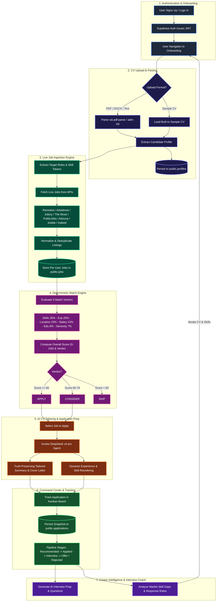
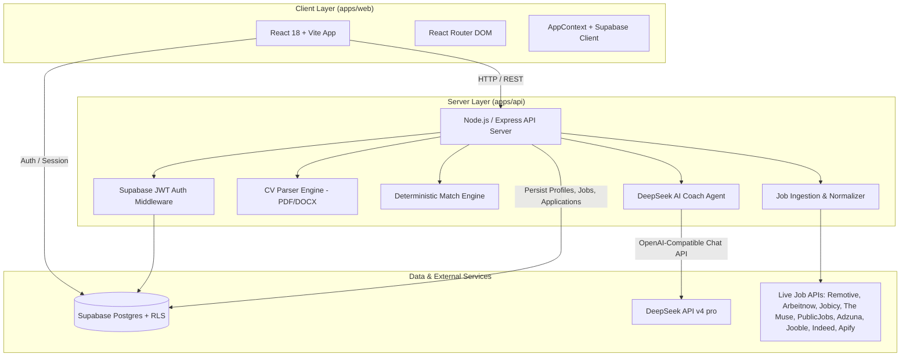
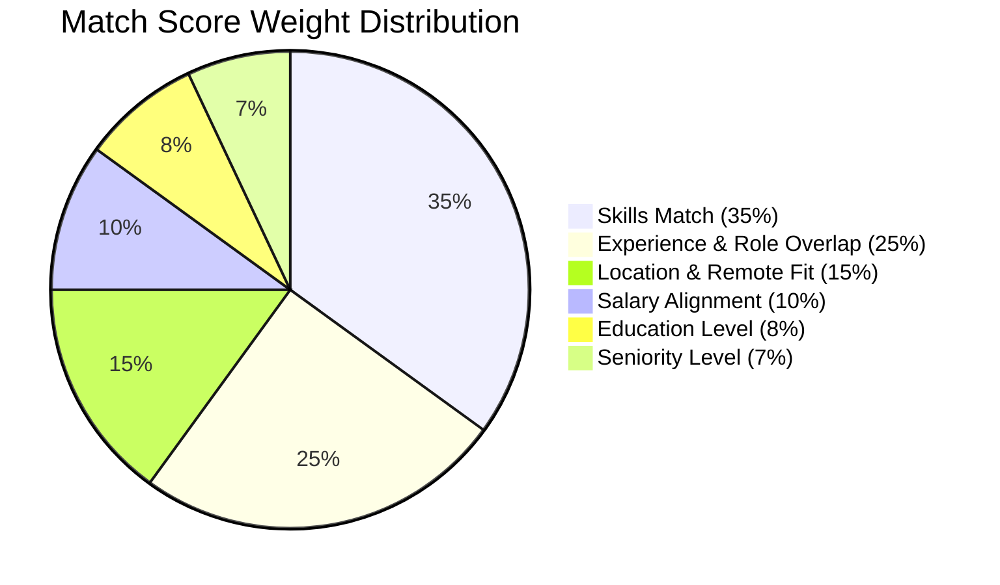
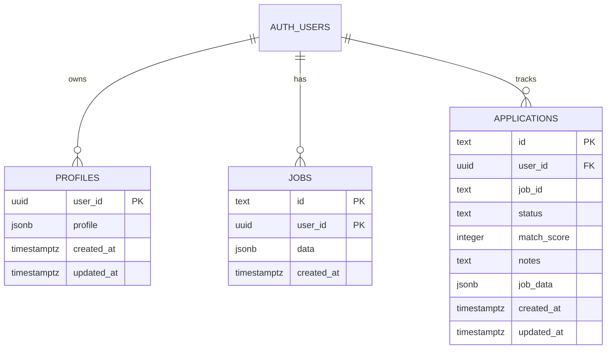

# JobPilot AI

[](LICENSE)
[](https://nodejs.org/)
[](https://www.typescriptlang.org/)
[](https://react.dev/)
[](https://vitejs.dev/)
[](https://tailwindcss.com/)
[](https://supabase.com/)
[](https://deepseek.com/)

**JobPilot AI** is an intelligent, full-stack job search copilot and automation engine built as a modern TypeScript monorepo. It transforms the job hunting process—from initial search to career improvement—into a streamlined, automated, and explainable pipeline:

$$\text{Find} \longrightarrow \text{Filter} \longrightarrow \text{Match} \longrightarrow \text{Tailor CV} \longrightarrow \text{Apply} \longrightarrow \text{Track} \longrightarrow \text{Improve}$$

Unlike traditional platforms relying on static or mock job rows, JobPilot AI ingests **live job postings** from multiple public APIs and job aggregators on-demand. It parses candidate CVs, generates structured profiles, performs explainable deterministic matching, offers AI-powered CV tailoring and cover letter generation, provides interview preparation, and delivers data-driven career intelligence.

---

## Table of Contents
1. [Key Features & User Workflows](#key-features--user-workflows)
2. [Project Flow](#project-flow)
3. [System Architecture & Tech Stack](#system-architecture--tech-stack)
4. [Matching & Scoring Engine](#matching--scoring-engine)
5. [Live Job Ingestion Providers](#live-job-ingestion-providers)
6. [Database Schema & Security](#database-schema--security)
7. [API Reference](#api-reference)
8. [Installation & Setup Guide](#installation--setup-guide)
9. [Environment Variables](#environment-variables)
10. [Monorepo Scripts](#monorepo-scripts)
11. [Subscription & Freemium Tiers](#subscription--freemium-tiers)

---

## Key Features & User Workflows

### 📄 CV Parsing & Profile Extraction
- **Multi-format Support**: Upload CVs in PDF (`pdf-parse`), DOCX (`adm-zip` XML extraction), plain text, or paste raw text. Built-in sample CV option available for instant testing.
- **Structured Profile Generation**: Extracts candidate contact details, headline, location, salary expectations, remote preferences, seniority level, education background, work history, and skills (categorized with years of experience and level).

### 🎯 Live Job Matching & Explainable Scoring
- **Real Postings**: Fetch live jobs matching candidate role tokens and skill profiles directly from official job board APIs.
- **Deterministic 0-100 Scoring**: Transparent sub-scores across 6 distinct categories (Skills, Experience, Location, Salary, Education, Seniority).
- **Application Probability & Verdicts**: Categorizes matched postings into actionable verdicts: `APPLY` (Score $\ge 80$), `CONSIDER` (Score $60-79$), or `SKIP` (Score $< 60$), accompanied by skill match breakdowns and estimated applicant competition.

### ✍️ Truthful AI CV Tailoring & Cover Letters
- **Truth-Preserving AI**: Powered by **DeepSeek v4 pro** (`deepseek-v4-pro`) via OpenAI-compatible chat completion endpoints. The AI is constrained to strict factual guidelines (*never invents credentials, skills, or experience*).
- **Deterministic Fallbacks**: Fully operational even if the LLM provider endpoint is unreachable or unconfigured.
- **Dynamic Reordering**: Highlights and reorders existing experience points and skills to maximize alignment with target job requirements.
- **Cover Letter Generator**: Drafts role-tailored cover letters highlighting relevant achievements.

### 📊 Application Command Center (Kanban Pipeline)
- **Interactive Kanban Board**: Drag-and-drop or status-toggle tracked jobs across pipeline stages (`Recommended`, `Applied`, `Interview`, `Offer`, `Rejected`, `No Response`).
- **Self-Contained Snapshots**: Tracked applications store full `job_data` JSON snapshots in PostgreSQL, ensuring data persistence even if job catalogs are rebuilt after uploading a new CV.

### 💡 Career Intelligence & Interview Coach
- **Career Insights**: Aggregates response rates, skill gap analysis (identifying missing high-value skills across postings), target roles, and market alignment.
- **AI Interview Simulator**: Generates role-specific behavior and technical interview questions, sample answers, and strategic preparation tips.

---

## Project Flow

The end-to-end data and user interaction flow moves seamlessly from authentication to continuous career improvement:



---

## System Architecture & Tech Stack



### Core Technologies

| Domain | Technology / Library | Purpose |
| :--- | :--- | :--- |
| **Monorepo** | `pnpm` Workspaces, `concurrently` | Workspace management and script execution |
| **Frontend Framework** | React 18, TypeScript 5.7 | User interface rendering and client state |
| **Build Tool & Bundler** | Vite 5.4, PostCSS, Tailwind CSS 3.4 | Development server, bundling, and responsive styling |
| **Backend Runtime** | Node.js (v22+), Express 4.21, `tsx` | REST API routes, middleware, server logic |
| **Document Processing** | `pdf-parse` (1.1.1), `adm-zip` (0.5.16) | Native PDF and DOCX text extraction |
| **Authentication & DB** | Supabase JS Client (`@supabase/supabase-js` v2.45) | Auth session management, PostgreSQL database, Row Level Security |
| **AI / LLM Integration** | DeepSeek API (`deepseek-v4-pro`) | Generative CV summaries, cover letters, and interview coaching |

---

## Matching & Scoring Engine

The matching engine computes a comprehensive **Overall Match Score** ($0-100$) using weighted sub-scores across key career vectors:

$$\text{Overall Score} = (S_{\text{skills}} \times 0.35) + (S_{\text{exp}} \times 0.25) + (S_{\text{loc}} \times 0.15) + (S_{\text{sal}} \times 0.10) + (S_{\text{edu}} \times 0.08) + (S_{\text{sen}} \times 0.07)$$



### Scoring Components Breakdown

1. **Skills Match ($35\%$)**: Evaluates overlap between candidate skill set and required/nice-to-have job skills detected via keyword normalization.
2. **Experience & Role Overlap ($25\%$)**: Measures candidate total years of experience against requested job years, combined with tokenized role title overlap.
3. **Location & Remote Fit ($15\%$)**: Factors in exact city match, country match, and remote/hybrid policy preferences.
4. **Salary Alignment ($10\%$)**: Compares candidate minimum salary expectation against job salary max limits (disclosed or estimated).
5. **Education Level ($8\%$)**: Compares required degree rank (Bachelors, Masters, PhD) against candidate qualifications.
6. **Seniority Level ($7\%$)**: Ranks candidate seniority (Intern, Junior, Mid, Senior, Lead, Staff, Principal) relative to the job's requirements.

---

## Live Job Ingestion Providers

JobPilot AI aggregates real-time job postings across multiple native job board APIs and aggregators:

| Provider | Endpoint / Protocol | Auth Requirements | Features |
| :--- | :--- | :--- | :--- |
| **Remotive** | `https://remotive.com/api/remote-jobs` | Public | Global remote developer & tech roles |
| **Arbeitnow** | `https://www.arbeitnow.com/api/v1/jobs` | Public | Tech postings based in Germany / Europe |
| **Jobicy** | `https://jobicy.com/api/v2/remote-jobs` | Public | Remote tech and software engineering roles |
| **The Muse** | `https://www.themuse.com/api/v1/jobs` | Public | US & international career listings |
| **PublicJobs.ie**| HTML Scraper (`https://www.publicjobs.ie`) | Public | Irish public sector postings |
| **Adzuna** | `https://api.adzuna.com/v1/api/jobs` | `ADZUNA_APP_ID`, `ADZUNA_APP_KEY` | International job aggregation (includes LinkedIn cross-posts) |
| **Jooble** | `https://jooble.org/api/` | `JOOBLE_API_KEY` | Worldwide job search engine aggregator |
| **Indeed (GraphQL)**| `https://apis.indeed.com/graphql` | OAuth Client Credentials | Native Indeed postings via official GraphQL API |
| **Apify Indeed** | `Apify Actor (misceres/indeed-scraper)` | `APIFY_API_TOKEN` | Scraped Indeed listings fallback |

---

## Database Schema & Security

The PostgreSQL database is hosted on Supabase and secured via strict **Row Level Security (RLS)** policies. All operational data is isolated per authenticated user (`auth.uid() = user_id`).



### Table Specifications

- **`public.profiles`**: Stores extracted user CV data, candidate preferences, skills, and work experience as a JSONB object (`user_id` PK).
- **`public.jobs`**: Per-user job catalog (`(user_id, id)` composite PK). Rebuilt dynamically whenever a new CV is uploaded.
- **`public.applications`**: Tracked applications in the Kanban pipeline (`id` PK). Contains a self-contained `job_data` JSONB snapshot so applications persist independently of job catalog updates.

---

## API Reference

All routes (except `/health`) require a valid Supabase JWT sent in the `Authorization: Bearer <token>` header.

| Method | Endpoint | Description |
| :--- | :--- | :--- |
| `GET` | `/health` | Unauthenticated server health check |
| `GET` | `/profile` | Retrieve candidate profile and current job market summary |
| `POST` | `/profile` | Manually update candidate profile object |
| `POST` | `/cv/analyze` | Upload CV text, PDF, or DOCX base64; parses profile & rebuilds jobs |
| `GET` | `/jobs` | Retrieve user's ingested live job list |
| `GET` | `/jobs/:id` | Retrieve single job by ID |
| `GET` | `/matches` | Retrieve all job matches sorted by match score |
| `GET` | `/matches/:jobId` | Retrieve match breakdown and sub-scores for a specific job |
| `GET` | `/digest` | Get daily match digest, top recommendations, and pipeline stats |
| `GET` | `/applications` | List all tracked applications |
| `POST` | `/applications` | Track a new job application (`jobId`, `status`) |
| `PATCH` | `/applications/:id` | Update application status or notes |
| `DELETE`| `/applications/:id` | Remove application from tracking pipeline |
| `GET` | `/insights` | Retrieve career intelligence, response rates, and skill gaps |
| `GET` | `/interview/:jobId` | Generate interview preparation questions & sample answers |
| `POST` | `/prepare/:jobId` | Tailor CV summary, bullet points, and draft cover letter for a job |

---

## Installation & Setup Guide

### Prerequisites
- **Node.js**: `v22.0.0` or higher
- **Package Manager**: `pnpm` (`v9+` recommended)
- **Supabase Account**: A running Supabase project with Postgres & Auth enabled.

### 1. Clone & Install Dependencies
```bash
git clone https://github.com/your-org/job-pilot-ai.git
cd job-pilot-ai
pnpm install
```

### 2. Configure Environment Variables
Create an `.env` file in `apps/api/.env` (and set client env variables in `apps/web` or `apps/web/src/supabase.ts`):

```bash
# apps/api/.env
PORT=4000
SUPABASE_URL=https://<your-project-ref>.supabase.co
SUPABASE_ANON_KEY=sb_publishable_...
# Optional: Allows backend ingestion to write per-user jobs directly
SUPABASE_SERVICE_ROLE_KEY=sb_secret_...

# AI LLM Provider Configuration
DEEPSEEK_API_KEY=sk-...
DEEPSEEK_BASE_URL=https://api.deepseek.com
DEEPSEEK_MODEL=deepseek-v4-pro

# Optional External Job Aggregator Keys
ADZUNA_APP_ID=...
ADZUNA_APP_KEY=...
JOOBLE_API_KEY=...
INDEED_CLIENT_ID=...
INDEED_CLIENT_SECRET=...
APIFY_API_TOKEN=...
```

### 3. Initialize Database Schema
Execute the database setup script located at `supabase/schema.sql` in the **Supabase SQL Editor**. This creates the required `profiles`, `jobs`, and `applications` tables, indexes, and RLS security policies.

### 4. Run Development Server
Start both backend API (`apps/api`) and frontend Vite server (`apps/web`) concurrently:
```bash
pnpm dev
```
- **Web App**: `http://localhost:5173`
- **API Server**: `http://localhost:4000`

---

## Environment Variables

| Variable | Scope | Required | Description |
| :--- | :--- | :--- | :--- |
| `PORT` | API | No | Express server port (default: `4000`) |
| `SUPABASE_URL` | API / Web | **Yes** | Supabase project URL |
| `SUPABASE_ANON_KEY` | API / Web | **Yes** | Supabase publishable/anon API key |
| `SUPABASE_SERVICE_ROLE_KEY` | API | No | Supabase service role secret (bypasses RLS for ingestion) |
| `DEEPSEEK_API_KEY` | API | **Yes** | DeepSeek API key for AI generation |
| `DEEPSEEK_BASE_URL` | API | No | DeepSeek API base endpoint (default: `https://api.deepseek.com`) |
| `DEEPSEEK_MODEL` | API | No | Model ID (default: `deepseek-v4-pro`) |
| `ADZUNA_APP_ID` | API | No | Adzuna Job API App ID |
| `ADZUNA_APP_KEY` | API | No | Adzuna Job API Key |
| `JOOBLE_API_KEY` | API | No | Jooble API Key |
| `INDEED_CLIENT_ID` | API | No | Indeed GraphQL Partner App Client ID |
| `INDEED_CLIENT_SECRET` | API | No | Indeed GraphQL Partner App Secret |
| `APIFY_API_TOKEN` | API | No | Apify API token for Indeed scraper actor |

---

## Monorepo Scripts

Command execution from the workspace root:

```bash
# Run API and Web apps concurrently in watch mode
pnpm dev

# Typecheck and build all workspace applications
pnpm build

# Perform TypeScript type-checking across all packages
pnpm typecheck

# Start the built production API server
pnpm start
```

---

## Subscription & Freemium Tiers

JobPilot AI includes built-in feature gating logic for freemium SaaS monetization:

| Plan | Price | Monthly CV Uploads | Applications / Mo | Features Included |
| :--- | :--- | :--- | :--- | :--- |
| **Free** | €0 / mo | 3 CV uploads | 10 Applications | Basic Job Matching, Basic Search Filters |
| **Job Seeker** | €12 / mo | 10 CV uploads | 50 Applications | Full Match Breakdown, Unlimited Job Searches |
| **JobPilot Pro** | €29 / mo | Unlimited | Unlimited | DeepSeek AI Tailoring, Cover Letters, Interview Coach, Skill Gap Analysis |
| **JobPilot Max**| €59 / mo | Unlimited | Unlimited | Priority Processing, AI Application Auto-Fill, 1-on-1 Career Strategy |

---

## License

This project is licensed under the [MIT License](LICENSE).


Development mode (two processes, hot reload):

    pnpm dev   # web -> http://localhost:5173 (proxies /api to :4000)

Note: email confirmation is auto-enabled for this demo (mailer_autoconfirm = true), so sign-ups get a
session immediately. Turn it back on in Auth settings for production.

---

---

## Run with Docker (single container + public ngrok tunnel)

The repo ships a Dockerfile plus a docker-compose.yml that runs JobPilot AI in a
container and automatically exposes it to the internet through an ngrok tunnel,
so every time the stack starts, the app is public.

    docker compose up -d --build

- App (web UI + API): http://localhost:4000
- Public URL: read it from the ngrok logs or the web inspector at http://localhost:4040
      docker compose logs ngrok | grep url=

Configuration lives in the `.env` file next to docker-compose.yml (copy
`.env.example` to `.env` first):

- NGROK_AUTHTOKEN (required) — from https://dashboard.ngrok.com
- SUPABASE_URL / SUPABASE_ANON_KEY / DEEPSEEK_API_KEY etc. (optional — the app
  runs with built-in fallbacks when empty)

Notes:

- Both services use `restart: unless-stopped`, so they come back up on reboot.
- The free ngrok plan allows one online tunnel at a time — stop any other ngrok
  process before starting the stack.
- To expose a local dev setup instead, run `pnpm dev` and `ngrok http 5173`.

---

## Applying the schema

The schema lives in supabase/schema.sql. Two ways to apply it:

- SQL Editor (recommended): paste the file into Supabase Dashboard -> SQL Editor -> Run.
- Management API: use a personal access token (sbp_...) with the database/query endpoint:

      POST https://api.supabase.com/v1/projects/<ref>/database/query
      Authorization: Bearer <sbp_...>
      { "query": "<statement>" }

  The Management API runs one statement per call; supabase/schema.sql is a sequence of statements.

---

## Database schema

    profiles        user_id (pk -> auth.users), profile jsonb, timestamps
    jobs            (user_id, id) (pk), user_id -> auth.users, data jsonb, timestamps
    applications    id (pk), user_id -> auth.users, (user_id, job_id) -> jobs, status, match_score, timestamps

Row Level Security: users can only read/write their own profiles, jobs, and applications rows
(auth.uid() = user_id). Uploading a new CV deletes that user's previous jobs (their applications
cascade-delete) and stores fresh jobs for the new profile.

---

## Live job data (no mock jobs)

Job postings are fetched from real, public job-board APIs and normalised into the `Job` domain type,
filtered against the candidate's roles/skills/location, deduplicated, and cached for 10 minutes.

| Provider  | Public API? | Key required? | Notes |
|-----------|-------------|---------------|-------|
| Remotive  | yes         | no            | remote-first tech jobs |
| Arbeitnow | yes         | no            | European jobs |
| Jobicy    | yes         | no            | remote jobs, structured salary |
| The Muse  | yes         | no            | company career pages |
| PublicJobs.ie | HTML board | no         | Ireland's public-sector board (civil service, HSE, local government, state bodies); parsed from Tal.net |
| Adzuna    | yes         | yes           | job-board aggregator (set `ADZUNA_APP_ID`/`ADZUNA_APP_KEY`) |
| Jooble    | yes         | yes           | aggregator; surfaces listings sourced from LinkedIn/etc. (set `JOOBLE_API_KEY`) |
| Indeed    | partner     | yes           | board-native postings via Indeed's GraphQL API (set `INDEED_CLIENT_ID`/`INDEED_CLIENT_SECRET`) |
| Indeed (Apify) | Apify actor | yes       | board-native postings scraped with `misceres/indeed-scraper`; returns at most **50 results per CV submission** (set `APIFY_API_TOKEN`) |

Job search is ordered by market: the candidate's country first, then a priority market (Ireland — since
Adzuna has no Irish index and PublicJobs/Jooble/Indeed carry the board-native Irish coverage), then
worldwide, and results are grouped by country in the UI.

Indeed's modern API is a GraphQL API at `https://apis.indeed.com/graphql`. The **Job Sync API**
(`jobsIngest.*` mutations) creates and manages job postings *on* Indeed (employer/ATS side), while the
candidate-facing **`jobSearch`** query retrieves live postings. `jobSearch` is gated: it requires the
`job-retrieval-service` entitlement on your Indeed partner app, so the adapter is enabled only when
`INDEED_CLIENT_ID`/`INDEED_CLIENT_SECRET` (or a pre-issued `INDEED_ACCESS_TOKEN`) are configured, and it
degrades to no results — never a hard failure — when that entitlement is absent.

**Indeed via Apify** (`APIFY_API_TOKEN` set) adds a second board-native Indeed source through the public
`misceres/indeed-scraper` actor, which needs no partner entitlement. On every CV submission it runs one
actor job for the candidate's role keywords and primary location (country codes map to the actor's enum,
e.g. Ireland -> `IE`), requests at most `maxItemsPerSearch: 50` postings, and hard-caps its contribution
at **50 results per CV submission** (deduplicated, normalised into the same `Job` type). The run is
started asynchronously and polled until it finishes (the actor uses residential proxies, so it can take a
couple of minutes); a failed or timed-out run degrades to zero Apify results, never a hard failure.

LinkedIn still offers no third-party public job-search API, so its listings continue to come through the
Adzuna/Jooble aggregators. The app never fabricates jobs, salary figures, or market statistics: every value
is either read from a posting or computed from the fetched set.

---

## Architecture

    +----------------+   Supabase Auth (JWT)   +---------------------------+
    |   Web Client   | ----------------------> |  API (Express)            |
    |   React + Vite |   Authorization header  |  verifies JWT -> user id  |
    +----------------+                         +-------------+-------------+
                                                            |
                          +----------------+----------------+----------------+
                          |                |                |                |
                    Candidate Service  Job Service   Application Service  AI Service
                          |                |                |                |
                          +----------------+----------------+----------------+
                                                            |
                                             +--------------+--------------+
                                             |  Supabase Postgres (RLS)    |
                                             |  profiles / jobs / apps     |
                                             +-----------------------------+
                                             |  DeepSeek v4 pro (LLM)      |
                                             +-----------------------------+

The matching engine is deterministic and explainable; DeepSeek handles the generative text (cover
letters, tailored summaries, recommendations, interview prep notes) with deterministic fallbacks.

---

## Project structure

    apps/
      api/
        src/
          domain.ts            # domain types
          config.ts            # env loading + config
          supabase.ts          # server-side Supabase clients
          auth.ts              # JWT verification middleware
          repo.ts              # Supabase-backed data access
          util.ts              # id + async handler helpers
          data/                # skill taxonomy, sample CV
          jobs/                # real job providers + ingestion
          parsing/             # CV parser + DOCX + PDF extractors
          matching/            # explainable match-scoring engine
          llm/provider.ts      # DeepSeek + deterministic fallback
          agents/              # orchestrator + specialist agents
          services/            # candidate/job/application/AI services
          routes/              # authenticated REST routes
          index.ts             # server bootstrap + static SPA serving
      web/
        src/
          supabase.ts          # browser Supabase client
          api.ts               # typed API client (attaches JWT)
          AppContext.tsx       # session + profile state
          pages/Auth.tsx       # sign in / sign up
          pages/*              # dashboard, matches, job detail, etc.
    supabase/schema.sql        # one-time migration (tables + RLS + seed)

---

## API

All endpoints under /api require Authorization: Bearer <supabase-access-token> except /health.

    GET  /api/health
    POST /api/cv/analyze            # parse + persist a CV (text | pdf/docx base64 | useSample)
    GET  /api/profile
    POST /api/profile
    GET  /api/jobs
    GET  /api/jobs/:id
    GET  /api/matches
    GET  /api/matches/:jobId
    GET  /api/digest
    GET  /api/applications
    POST /api/applications
    PATCH /api/applications/:id
    POST /api/applications/:jobId/prepare
    GET  /api/career/insights
    POST /api/interview/simulate

---

## Matching engine (explainable by design)

The overall score is a weighted sum of seven categories:

    skills (34%), experience (20%), location (10%), salary (10%),
    education (10%), seniority (10%), work authorization (6%)

Skill matching uses a synonym-aware taxonomy. Nice-to-have skills are weighted at 40% of required
skills. Recommendations: >=80 APPLY, >=62 CONSIDER, otherwise SKIP.

---

## AI (DeepSeek v4 pro)

Set DEEPSEEK_API_KEY (and optionally DEEPSEEK_BASE_URL / DEEPSEEK_MODEL) in apps/api/.env. The provider
calls the OpenAI-compatible POST {base}/chat/completions endpoint with model deepseek-v4-pro. If the call
fails or no key is configured, each agent falls back to a deterministic template, so the product always
works.

---

## Production hardening (next steps)

- Enable email confirmation and password-reset emails for production auth.
- Add vector embeddings for semantic skill matching.
- Obtain an Indeed partner app with the job-retrieval-service entitlement to unlock Indeed's GraphQL
  `jobSearch` (the adapter is already wired in and activates once `INDEED_CLIENT_ID`/`INDEED_CLIENT_SECRET`
  are set). Board-native Indeed search already works without the entitlement via the Apify
  `misceres/indeed-scraper` provider (`APIFY_API_TOKEN`), which returns up to 50 results per CV submission.
  Add a LinkedIn partner integration for board-native LinkedIn listings.
- Rate limiting, audit logging, and per-user plan/subscription enforcement.
- Split into Java/Spring Boot + Python/FastAPI services behind an API gateway, orchestrated with Docker
  Compose / Kubernetes and Kafka.

